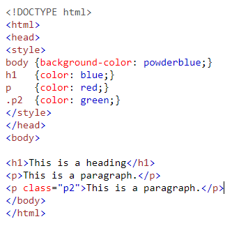

# CSS und allgemeine Hintergrundinformationen

## Was ist CSS?

Cascading Style Sheets (CSS) ist eine programmiersprache , die es ermöglicht, das Design von elektronischen Dokumenten zu bestimmen.

CSS gehört genau wie HTML zu den Kernsprachen des World Wide Webs. Während Sie eine Webseite mithilfe von HTML mit Text befüllen und semantisch strukturieren, legen Sie mit CSS das Design dieser Inhalte fest. Obwohl HTML und CSS in Kombination miteinander verwendet werden, existieren die CSS-Gestaltungsanweisungen und die HTML-Elemente getrennt voneinander. Das bedeutet, dass eine Maschine ein elektronisches Dokument auch ohne CSS lesen kann. Mithilfe von CSS werden die im Browser geöffneten Inhalte optisch aufbereitet und so auf ansprechende Weise dargestellt.

### CSS - Geschichte

CSS ist ein „living standard“ (lebendiger Standard) und wird vom World Wide Web Consortium kontinuierlich weiterentwickelt. Aus diesem Grund gibt es immer wieder neue Funktionen und praktische Anwendungsmöglichkeiten zu entdecken. Entstanden ist die weit verbreitete Stylesheet-Sprache in den 1990ern. Die Idee, Stylesheets zur Darstellung von Web-Inhalten zu verwenden, war zu dieser Zeit aber schon nicht mehr vollkommen neu. Doch CSS unterschied sich in einem wichtigen Punkt von anderen darstellungsorientierten Elementen, die es schon in HTML gab: Mit ihr hatten Nutzer nun die Möglichkeit, über mehrere Dokumente hinweg und in einem einzigen Stylesheet Design-Regeln für Elementgruppen zu definieren.

CSS ist eine Programmiersprache zur optischen Gestaltung von Webseiten. Mithilfe von CSS bestimmen Sie zum Beispiel, in welcher Schriftart, Größe oder Farbe bestimmte HTML-Elemente dargestellt werden sollen.

## Die Vorteile und Anwendungsbereiche von CSS

Eine gute Website lebt nicht nur von ihrem Inhalt, sondern auch von ihrem Design. Ist dieses nicht nutzerfreundlich oder ansprechend aufgebaut, verlieren Nutzer schnell das Interesse. CSS bietet Ihnen in diesem Zusammenhang eine Reihe von Gestaltungsmöglichkeiten, die im reinen HTML nicht vorhanden sind.

CSS erlaubt es Ihnen zum Beispiel, bestimmte Festlegungen zentral zu steuern. Das heißt, dass ähnliche Elemente (wie beispielsweise alle Hyperlinks oder Bilder) innerhalb desselben Dokuments erkannt und durch einen einzigen Befehl formatiert werden. Die Gestaltungsanweisungen müssen dabei nicht in Form eines internen Stylesheets im HTML-Dokument selbst vorhanden sein. Speichern Sie die CSS-Anweisungen in einem externen Stylesheet, also einer separaten Datei, ist diese auch für andere Dokumente verwendbar.

Neben grundlegenden Darstellungsanweisungen, die Farben, Formen und Typografie der HTML-Elemente betreffen, gibt es in CSS mittlerweile auch anspruchsvollere Module. Mit diesen können Sie zum Beispiel Animationen oder verschiedene Darstellungen je nach Ausgabemedium definieren. So lässt sich dasselbe HTML-Dokument für alle möglichen Medien identisch aufbereiten. Da in diesem Dokument Inhalt und Gestaltung getrennt sind, wird der Code der Website dadurch übersichtlicher. Noch mehr Möglichkeiten bietet die verwandte Style-Sprache SASS, die CSS jedoch nicht komplett ersetzt.

### CSS Anwendungsmöglichkeiten

Die Anwendungsmöglichkeiten von CSS sind sehr groß, natürlich gibt es gerade für Randbereiche andere, bessere Techniken, aber das allgemeine Styling ist mit CSS mehr als nur praktisch.

| Elemente               | Styles                                                  | Beispiel                                                         |
| ---------------------- | ------------------------------------------------------- | ---------------------------------------------------------------- |
| Text Styles            | Schriftart, Schriftgröße, Farbe, Zeilenabstand und mehr |  |
| Block/Conatiner Styles | Position, Größe, Hintergrundfarbe, Schatten             |                          |
| Bilder                 | Einfügen und Darstellen von Bildern                     |                                   |
| Positionierungen       | Übereinander geschichtete Ebenen                        |                         |
| Animationen            |                                                         |

## Praktischer Nutzen von CSS

Um dir einen Eindruck zu verschaffen, was genau du mit CSS erreichen kannst, hast du hier ein paar Links.

Generell gilt der Merksatz: Löse alles mit CSS, was mit CSS lösbar ist!
Im großen und ganzen sollte man eine CSS-Lösung immer einer JS-Lösung, aus folgenden Gründen vorziehen:

1. Performance/Ladezeiten
2. Manche Browser blockieren standardmäßig auszuführendes JS, dass Animationen usw abspielen soll
3. CSS ist mitlerweile mächtig genug um auf JS zu verzichten.

[Hover Effect](https://tympanus.net/Tutorials/OriginalHoverEffects/)

[Image Accordion](https://tympanus.net/Tutorials/CSS3ImageAccordion/)

[Werbe-Animation](https://codepen.io/marianab/full/XPOQaR/)

Bei solch komplexen Animationen sollte man CSS mit Javascript verknüpfen.

[Cube](https://webkit.org/blog-files/3d-transforms/morphing-cubes.html)

## Die verwendung von CSS auf HTML Elemente

Es gibt mehrere Wege CSS Anzuwenden. Neben Frameworks wie Bootstrap und Tailwind gibt es auch klassische varianten wie SASS und CSS.
Doch so unterschiedlich die Wege auch sind, so basieren sie alle auf CSS und werden bei der Compelierung der Seite zu CSS compeliert.

### Inlinestyle

Eine variante CSS Anzuwenden ist dieses direkt im HTML Dokument (im Tag) zu Verwenden.
Das ganze wird durch den Tag style="" eingeleitet.

`
Content
`

Content

### Script

Eine andere Variante, die ebenfalls im HTML Dokument angewendet werden kann, ist es einen Script Tag zu verwenden. Innerhalb dieses Script Tags, können ebenfalls id´s und classes verwendet werden.

### externes Stylesheet

Die beste und wohl verbreiteste Anwendung von CSS ist das externe Stylesheet. Dieses muss in das HTML Dokument eingebunden werden, da es eine eigene Datei mit der Endung .css ist.

## Abschluss

Nachdem du mit allen Aufgaben fertig bist kannst du dein Wissen gerne mit einem kleinen CSS Quiz testen.
[Hier gelangst du zum CSS-Quiz von W3Schools](https://www.w3schools.com/quiztest/quiztest.asp?qtest=CSS).
