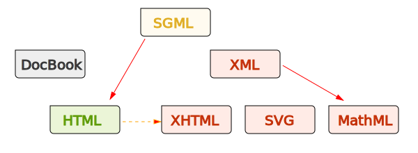
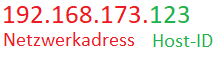

# HTML und allgemeine Hintergundinformationen

## Was ist HTML?

HTML ist eine „Sprache“ für Computer und die Abkürzung des englisches Begriffes „Hypertext Markup Language“. Übersetzt könnte man sagen: „Auszeichnungssprache für Hypertext“. HTML ist die Grundlage für alle Seiten im Internet und besteht seit 1992. Ein Hypertext ist ein Text, der mit anderen Texten verbunden ist.

Mit HTML baut man die Grundstruktur einer Webseite auf, welche dann mit CSS und diversen Scriptsprachen verknüft werden kann.

## HTML - Geschichte

HTML wurde 1990 vom Web-Gründer Tim Berners-Lee als Auszeichnungssprache entwickelt, die auf SGML basiert.
SGML ist eine Metasprache, die ab 1960 Texte standardisieren und für Computer lesbar machen sollte.

Wer mehr Informationen zu diesen Theman sucht, findet diese im [Museum für Webdesign](https://www.webdesignmuseum.org/web-design-history/timeline-1990-1994)

## Wie arbeitet das Internet?

Das Internet ist ein gigantisches Netzwerk aus Servern und Routern (Hardware), ganz ähnlich wie bei uns zuhause. Auch wir haben ein Netzwerk, bestehend aus einem Router und eigenen sogeannten "Clients". Ein Client ist das jeweilige Endgerät (TV. PC, Handy, Drucker, Toaster usw.)
Doch die beste Hardware ist ohne eine vernünftige Software nur technischer Schrott.

[Was ist das Internet?](https://de.wikipedia.org/wiki/Internet)
[Wie funktioniert das World Wide Web?](https://de.wikipedia.org/wiki/World_Wide_Web)

### Welche Aufgaben und Vorzüge hat ein Netzwerk?

Hauptaufgabe eines Netzwerks ist es, den Teilnehmern eine Plattform für den Austausch von Daten und die gemeinsame Nutzung von Ressourcen zu bieten. Diese Aufgabe ist von so zentraler Bedeutung, dass große Teile des heutigen Alltags und der modernen Arbeitswelt ohne Netzwerke nicht mehr vorstellbar sind.

Dazu ein Beispiel aus der Praxis: In einem typischen Büro hat jeder Arbeitsplatz seinen eigenen Computer. Ohne eine Vernetzung der Rechner wäre es für ein Team sehr umständlich, an einem Projekt zusammenzuarbeiten, da es keinen gemeinsamen Ort zum Teilen oder Hinterlegen von digitalen Dokumenten und Informationen gäbe und die Mitarbeiter bestimmte Programme nicht wie gewohnt gemeinsam nutzen könnten.

Außerdem gibt es in vielen Büros nur einen bzw. einige wenige Drucker, die von allen gemeinsam genutzt werden. Ohne Netzwerk müsste die IT jeden einzelnen Rechner mit dem Drucker verbinden, was technisch nur mit viel Aufwand umzusetzen ist. Ein Netzwerk löst dieses Problem auf elegante Weise, da alle Computer über einen zentralen Knotenpunkt mit dem Drucker verbunden sind.

**Die Hauptvorteile von Netzwerken sind also:**

- Nutzung gemeinsamer Daten
- Nutzung gemeinsamer Ressourcen
- Zentrale Steuerung von Programmen und Daten
- Zentrales Speichern und Sichern von Daten
- Teilen von Rechenleistung und Speicherkapazität
- Einfache Verwaltung von Berechtigungen und Zuständigkeiten

### TCP/IP

Die Internet Protocol Address, kurz IP-Adresse, ist eine Adresse in einem Computernetzwerk wie beispielsweise dem Internet. Jedes Gerät in einem Netzwerk hat eine einmalige IP-Adresse, die automatisch vergeben wird und auf dem Internetprotokoll basiert. Diese einzigartige Kennung ermöglicht die richtige und zielgenaue Versendung von Datenpaketen. Die IP-Adresse kann dabei einem einzelnen Empfänger oder einer Gruppe von Empfängern zugeordnet werden. Umgekehrt können aber auch mehrere IP-Adressen einen einzelnen Empfänger bezeichnen.

Eine IP-Adresse ist wie eine postalische Anschrift – sie muss übereinstimmen, damit jegliche Daten von einem zum anderen Computer gesendet werden können und auch ankommen. Jedes Gerät hat eine eigene – individuelle – IP-Adresse, die beim Transfer zugeordnet werden kann. Sie besteht aus kryptischen Zahlen und dient der grundlegenden Kommunikation von Computern untereinander.

Der Aufbau erfolgt immer auf die gleiche Weise – unabhängig davon, ob es sich um Desktop-Computer, Laptops oder Smartphones handelt.

**Arten von IP-Adressen**

In der Regel gibt es zwei Arten von IP-Adressen, statische und dynamische IP-Adressen.
Während statische IP-Adressen bevorzugt von Servern und Anlagen verwendet werden, so werden dynamische IP-Adressen im Alltag verwendet. Ein gutes Beispiel ist die IP-Adresse deines Routers, diese ändert sich in der Regel alle 24 Stunden.

Warum ein Server eine statische IP-Adresse verwenden sollte, ist eigl ganz schnell erklärt. Jede URL (https://www.google.de) ist eine IP-Adresse aufgelöst durch einen DNS-Service in Wort und Schrift.

Kurz ist das Domain Name System (DNS) für die Kommunikation zwischen Mensch und Maschine zuständig. So wird unsere Suchanfrage www.google.de via DNS für die Maschine in die (www.google.de)[IP 142.250.186.35](142.250.186.35) übersetzt.

### TCP

TCP steht für Transmission Control Protocol und ist eine Reihe von Kommunikationsprotokollen, die verwendet werden, um Netzwerkgeräte im Internet miteinander zu verbinden. TCP/IP wird auch als Kommunikationsprotokoll in einem privaten Computernetzwerk (einem Intranet oder Extranet) verwendet.

Themen: Netzwerk, TCP/IP, UDP HTTP, Internetprotokolle [und mehr](https://cewebs.cs.univie.ac.at/nt/ss13/index.php?m=F&t=vorlesung&c=afile&CEWebS_what=Vorlesung&CEWebS_rev=65&CEWebS_file=2013-05-15_Kapitel-4_Teil-3.pdf)

## HTML - Der Grundaufbau

Nun endlich kommen wir zum spannenden Thema HTML. HTML ist die grundstruktru jeder Webseite, auf dieser Grundstruktur bauen das Styling und diverse Scriptsprachen, wie z.B. Javascript, auf.

HTML arbeitet mit sogenannten Tags, einen Tag erkennt man an der öffnenden und schließenden Klammer:

>       <tagname>...Inhalt...</tagname>

Während es unerlässliche Tags gibt, gibt es auch eine Vielzahl von Tags, die nicht zwangsweise verwendet werden müssen.
Allerdings ist der Grundaufbau eines HTML Dokumentes immer gleich.
[HTML-Grundstruktur](./html-basics.html)

[DOCTYPE](https://www.w3schools.com/tags/tag_doctype.asp)

### HTML Tags

| Open/Closing Tag                | Beschreibung                                                                                                          | Beispiel                                                                                         |
| ------------------------------- | --------------------------------------------------------------------------------------------------------------------- | ------------------------------------------------------------------------------------------------ |
|                                 | **HTML Struktur**                                                                                                     |
| `<!-- Text --->`                | ein einzeiliger Kommentar, dieser wird nicht verarbeitet und nur im Code angezeigt                                    | <!-- Hier ist ein einzeiliger Kommentar! -->                                                     |
| `<html></html>`                 | Öffnet und schließt den Bereich des Dokuments in dem HTML verwendet werden darf. (Root)                               |
| `<head ></head>`                | Bereich um Daten zu Deklarieren in Form von Metadaten, importien von Stylesheets und Verlinkungen zu anderer Software |
| `<body></body>`                 | Definiert den Körper der Webseite mit allem Kontent                                                                   |
|                                 | **Block-Elemente**                                                                                                    |                                                                                                  |
| **Was ist ein Block-Element?**  | Unter Block-Element versteht man Elemente die eine neue Zeile beginen und 100% der Breite einnehmen                   | `<header>, <footer>, <nav>, 
, 
,<article>, <aside>, <ul>, <li>, <form>, <table>, <video>` |
|                                 | **Überschriften**                                                                                                     |
| `<h1> <h6>`                     | Der h1-Tag ist einmalig auf jeder Seite. Es ist die Hauptüberschirft der Seite.                                       |                                                                      |
|                                 | **Inline-Elemente**                                                                                                   |                                                                                                  |
| **Was ist ein Inline-Element?** | Ein Inline-Element richtet seine Breite nach dem Inhalt, wodurch man z.B. einzelne Textpassagen stylen kann.          | `<a>, <b>,  , <button>, <em>, <i>, , <input>, <lable>, , <textarea>`               |
|                                 | **Gängigsten Tags**                                                                                                   |                                                                                                  |
| ``                       | Mit dem a-Tag erzeugt man einen Link                                                                                  |                                                                                                  |
| `<aside></aside>`               |                                                                                                                       |                                                                                                  |
| `<b></b>`                       | bold macht den Text Fett gedruckt                                                                                     | <b>Dieser Text ist bold</b> (Veraltet)                                                           |
| ` `                        | erzwingt einen Zeilenumbruch                                                                                          | Dieser Text ist  gebrochen                                                                   |
| `<button></button>`             | Erzeugt einen Button                                                                                                  | <button>Klick Mich</button>                                                                      |
| `

`                   | Ein Div ist einer der am häufigsten genutzten Kontainer                                                               |                                                                                                  |
| `<form></form>`                 | Erzeugt ein Formular wie man es aus Kontakt oder Login Formularen kennt                                               |                                                                                                  |
| `<i></i>`                       | italic                                                                                                                | <i>Dieser Text ist italic</i> (Veraltet)                                                         |
| `<input />`                     | Ein Imputfeld ist ein Feld in dem User Text eingeben können                                                           | <input />                                                                                        |
| `</img>`                   | Um Bilder einzufügen verwendet man das img Tag, hierzu gibt es weitere Attribute                                      |                                                                                                  |
| ``                 | Ein Span wird verwendet um Text ohne Auswirkungen zu formatieren                                                      |                                                                                                  |
| `<strong></strong>`             | Strong hebt den Text hervor und markiert ihn für Google                                                               | <strong>Strong ist ähnlich wie bold</strong>                                                     |
| `<textarea>`                    | Ein Texteingabefeld, das Fließtexte beinhalten kann.                                                                  | <textarea>Hallo world, hier kommt mein HTML!</textarea>                                          |
| `<ul></ul >`                    | unorderd List                                                                                                         | <ul><li>unorderd Listeneintrag</li></ul>                                                         |
| `<ol></ol>`                     | orderd List                                                                                                           | <ol><li>orderd Listeneintrag</li></ol>                                                           |
| `<li></li>`                     | List Item, eine Zeile in einer Liste                                                                                  |                                                                                                  |

## Tags und ihre Attribute

Unter einem Attribut könnte man sich eine Erweiterung vorstellung. Das bedeutet man kann Tags durch Attribute veändern. Es gibt eine lange Liste von Attributen, von denen man die meisten nicht wirklich nutzt.

Die wohl am häufigstverwendeten Attribute siehst du in der Liste.

| Command               | Beschreibung                                                                                                                          | HTML                                                                              | CSS/Vorschau                                                                                       |
| --------------------- | ------------------------------------------------------------------------------------------------------------------------------------- | --------------------------------------------------------------------------------- | -------------------------------------------------------------------------------------------------- |
| class                 | Eine Klasse ist eine wiederverwendbare Ansammlung von Styeles. Im stylesheet wird eine class mit einem `.` angesprochen               | `
TEXT
`                                             | .divSettings{color: red;}                                                                          |
| id                    | Eine ID ist wie eine Klasse, nur dass sie einmalig vergeben wird. Im stylesheet wird eine id mit einem `#` angesprochen               | `
TEXT
`                                             | #divSettings{color: red;}                                                                          |
| style                 | Initialisiert inline Styles                                                                                                           | `
TEXT
`                                              |                                                                                                    |
| alt                   | Legt den Alternativen Text fest, falls ein Bild nicht angezeigt werden kann oder zum Vorlesen für beeinträchtigte Peronen             | `</img>`                                              |                                                                                                    |
| src                   | Damit legt man den Pfad die Quelle (source) des Bildes/der Datei fest.                                                                | `TEXT</img>`                                        |                                                                                                    |
| type                  | Es gibt verschiedene Typen: text, checkbox, radio, email                                                                              | `<input type="checkbox"></input>`                                                 | <input type="checkbox"></input>                                                                    |
| checked               | Um einer Checkbox als default zu Aktivieren gibt es das Attribut checked                                                              | `<input type="checkbox" checked" />`                                              | <input type="checkbox" checked></input>                                                            |
| selected              | Eine option kann mit dem Attribut selected als ausgewähltes Feld vordefiniert werden                                                  | `<input type="radio" selected />`                                                 | <select><option type="radio" >Feld1</option><option type="radio" selected >Feld2</option></select> |
| value                 | Value ist der Wert in einem Feld. Durch die Zuweisung eines Wertes wird dieser Wert an das Feld übergeben.                            | `<input type="text" value="Valuetext" />`                                         | <input type="text" value="Valuetext" />                                                            |
| placeholder           | Hiermit lässt sich ein Beispieltext erzeugen                                                                                          | `<input type="text" placeholder="Platzhaltertext" />`                             | <input type="text" placeholder="Platzhaltertext" />                                                |
| disabled              | Verschiedene Elemente können disabled werden. Ein Button z.B. kann so lange disabled werden, bis alle nötigen Felder ausgefüllt sind. | `<button class="divSettings">TEXT</button>`                                       | <button >Aktiviert</button> <button disabled>Deaktiviert</button>                                  |
| target                | Das target="\_blank" Attribut sorgt dafür, dass beim öffnen ein neuer Tab im Browser geöffent wird.                                   | `<a href="https://google.com" target="_blank" rel="noopener noreferrer">Link</a>` | <a href="https://" target="_blank" rel="noopener noreferrer">Link</a>                              |
| loop, muted, controls | Videos und Audio Dateien können diese Attribute erhalten                                                                              |                                                                                   |                                                                                                    |

## Abschluss

Nachdem du mit allen Aufgaben fertig bist kannst du dein Wissen gerne mit einem kleinen HTML Quiz testen.
[Hier gelangst du zum HTML-Quiz von W3Schools](https://www.w3schools.com/quiztest/quiztest.asp?qtest=HTML).
