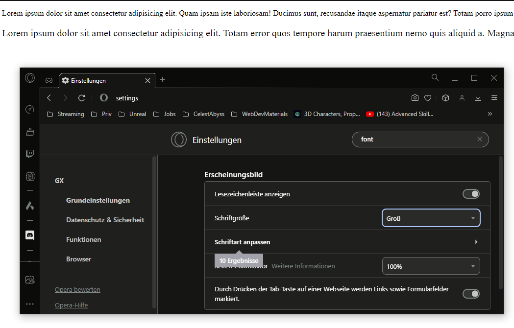

# Einleitung

Oft kommt es vor, dass wir Elemente in der Größe einschränken oder genau bestimmen möchten. Dafür nutzen wir `width` = Breite und `height` = Höhe.
In der letzten Aufgabe haben wir gesehen, dass `div, p` und manch andere Elemente immer 100% der Breite der Seite einnehmen (siehe hierzu README-HTML.md im Punkt Block-Elemente).

## Beispiel Width:

Wir begrenzen die Größe des Div´s auf 100px

```html
<div style="width: 100px; border: solid;">
  <p>My Text</p>
</div>
```

<div style="width: 100px; border: solid;">
  <p>My Text</p>
</div>

## Beispiel Height

Wir setzen nun zusätzlich die Hight des Div´s auf 100px

```html
<div style="width: 100px; height: 100px; border: solid;">
  <p>My Text</p>
</div>
```

<div style="width: 100px; height: 100px; border: solid;">
  <p>My Text</p>
</div>

## Einheiten

Bisher haben wir mit der Einheit `px` gearbeitet. Allerdings gibt es verschiedene Einheiten wie Beispielweise `px, pt, em, rem, %`

- px = Pixel (leicht veraltet)
- pt = dots/points (veraltet)
- em = Ein em bezieht sich auf die standard Rooteinstellung, diese Entspricht 16px. Setzen wir allerdings in einem Parentelement zum Beispiel im body eine `font-size: 12px` dann entspricht `1em` in allen children `12px` statt `16px`.
- rem = 1rem entspricht immer der Rooteinstellung.
- % = Mit % lassen sich Bildschrim unabhängige Größen Verhältnisse bestimmen. `width: 80%;` sind immer 80% der Fenstergröße ob am Handy, Tablet oder Desktop.

Es gibt noch einige Mehr, dazu kommen wir noch.

### EM / REM

EM und REM sind neuere Einheiten in CSS. Diese bieten den Vorteil, dass sie Skalable sind. Das bedeutet da `em` und `rem` von den root-Einstellungen abhängen, kann je nach User- und Geräteeinstellungen, `1rem/1em` unterschiedlich groß/klein ausfallen.

Ein für uns schönes Beispiel sind die `16px`, die die Standardgröße in Desktopbrowsern sind, diese wird auf Mobilen Endgeräten ja nach Browser auf 10-16px gesetzt. Dadurch würde sich unsere Webseite automatisch anpassen.

Ein weiterer und noch wichtigerer Punkt sind die gestezten User-/Systemeinstellungen. So würde die Seite dem entsprechend skallieren je nachdem ob ein User seine Schriftgröße größer oder kleiner eingestellt hat.

## Aufgaben

1. Erstelle ein ´div´ mit einer Breite von 80% und einer Höhe von 300px. Fülle das div mit einem Beispieltext (Lorem).
2. Setze die Schriftgröße im ersten `div` auf 16px.
3. Erstelle ein weiteres `div` mit den selben Spezifikationen wie das erste div. Setze hier die Schriftgröße auf `1rem`.
4. Gehe in deine Browser Einstellungen und Stelle die Schriftgröße um und beobachte deine Webseite.



5. Erstelle ein weiteres Div und probiere weitere Einheiten aus wie `pt und em`
