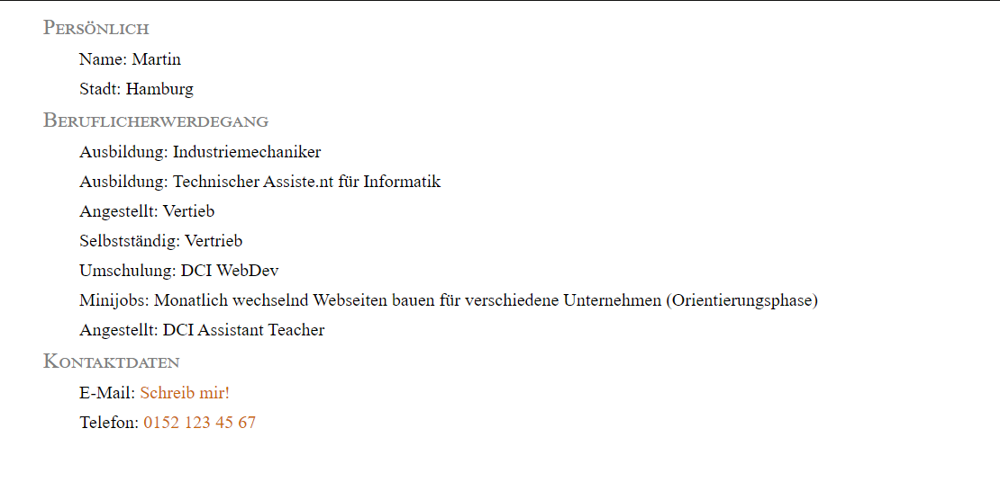

# Aufgaben

**Hinweis:** Nutze deine eigenen Daten, soweit du möchtest. Email und Telefon NICHT! Hier verwendest du bitte die Dummydaten ^^

- Erstelle eine Liste (ordered oder unordered) mit folgendem Inhalt:
  - Persönliche Daten (Vorname, Stadt)
  - Beruflicherwerdegang (Studium, Ausbildungen, Jobs)
  - Interessen (deine Hobbys)
  - Kontakt (E-Mail = `myMail@mail.com`, Telefon = `01521234567`)
- Jeder Bereich sollte eine eigene Überschrift haben, die aber Teil der Liste sind.
- Die beiden Kontaktfelder sollen eine angenehme UX haben. [siehe hier](https://www.w3schools.com/tags/tag_a.asp)
- Passe das Styling der Liste dem Referenzbild möglichst genau an.

### Styles

Schriftgrößen: 24px und 20px
Farben: black, gray, chocolate

Zusätzliche Themen:

- Anker-Tag für Mail und Telefon
- Spezielle Font Einstellung für `small-caps` 🤫

**Achtung:** Manche der CSS Eigenschaften werden an Kindelemente vererbt 😉

## Auflösung

