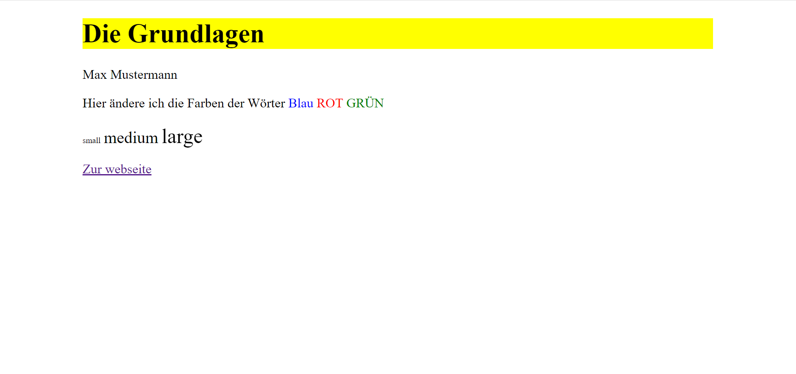

# Aufgaben

Hier findest du die Aufgaben, arbeite diese ab und versuche so viele Punkte wie möglich zu erfüllen. Unten findest du ein Bild, wie die Seite am Ende aussehen sollte.

Viel Spaß!

- Erstelle eine `index.html` Datei
- Schreibe die HTML-Grundstruktur
- Erstelle im Body 3 div Conatiner mit einer Breite von 80% und versuche die div Container zu zentrieren. [margin](https://www.w3schools.com/css/css_margin.asp)
- Im ersten div erstellst du eine h1 Überschrift "Die Grundlagen"
- Erstelle einen Paragraphen, im mittleren div mit deinem Namen darin
- Im dritten div legst du verschiedene Elemente an:
  - Einen Paragaphen mit dem Text: Hier ändere ich die Farben der Wörter "BLAU", "ROT", "GRÜN"
    - Ändere die Farbe des Wortes (BLAU = blau, ROT = rot, GRÜN = grün)
  - Erstelle einen weiteren Paragraphen mit dem Text: Small medium large und
    ändere die Schriftgrößen auf: 1rem, 2rem, 2.5rem
  - Einen Link der auf diese [Webseite](https://www.w3schools.com/html/html_links.asp) führt.
  - Nun ändere die background-color der des oberen div Containers auf eine beliebige Farbe.

## Auflösung

