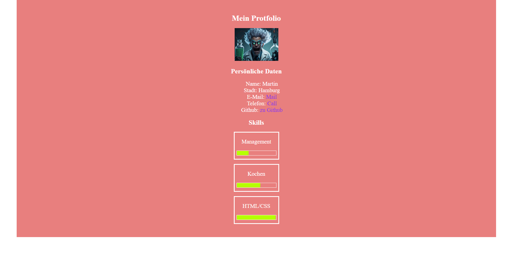

# Einleitung

Hier haben wir nun eine etwas größere Übung, die alles ein wenig zusammenfasst.

Diese Seite wird eine Art grobes Portfolio mit einigen Tricks.

## Progressbar

Es gibt einen sehr simplen Weg einen Progressbar zu bauen. Dazu benötigt ihr 2 verschachtelte Div-Container, eine Hintergrundfarbe und einen Width Wert 😉

## Main Container

Der `main` Tag ist ein Semantischer Tag, der der oberste Container innerhalb des Bodys ist. Neben dem Main Container gibt es noch viele weitere semantische Tags.

```html
<body>
  <main>
    <!-- All stuff of your Webside -->
  </main>
</body>
```

## Aufgaben

- Erstelle einen `main` Container mit...
  - einer Breite von 80%
  - zentriere ihn
  - geben ihm einen Hintergrundfarbe
  - gebe ihm 1,5rem Padding
- Erstelle einen Überschrift für die Seite
  - Zentriere die Überschrift (`text-align`)
- Erstelle eine kleine Liste mit deinem Vornamen, deiner Stadt, Kontaktdaten (E-Mail, Telefon und einem Link zu deinem Github)
  - zentriere die Liste
  - Färbe die Anker-Tags in `blueviolet`
- Erstelle eine weitere Überschrift Namens "Skills" und zentriere auch sie
- Erstelle mindestens 3 Cards (div)
  - In jeder Card steht der Name deines Skills und ein `Progressbar` (siehe oben!)
  - lasse den Progressbar ungefähr Anzeigen, wie du dich selbst einschätzt (bezogen auf Hobbys, vorherige Jobs und Kenntnisse)
- Im Ordner images ist ein Bild, füge dieses Bild zwischen der h1 und der ersten h2 ein und Zentriere es. Finde dafür heraus ob ein Bild ein block- oder inline Objekt ist und wie du es ansprechen kannst.

  
