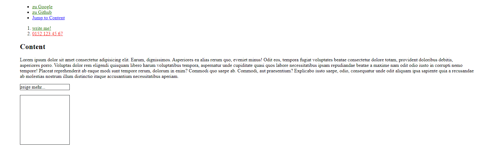

# Einleitung

Es gibt verschiedene Selektoren, die wir für CSS und später für JS verwenden können.

Hier sind einige Beispiele für ansprechbare HTML Elemente:

| Name           | Beispiel                        | Beschreibung                                                                                                                                                                                                                            |
| -------------- | ------------------------------- | --------------------------------------------------------------------------------------------------------------------------------------------------------------------------------------------------------------------------------------- |
| Tag            | body, main, div, p, a, img usw. | Tags sind der einfachste Weg um HTML Elemente anzusprechen.                                                                                                                                                                             |
| tag + tag      | ul li                           | Um Elemente genauer ansprechen zu können, kann man diese hintereinander auflisten. ACHTUNG: Solltest dumehr als 3-5 Tags hintereinander schreiben müssen um etwas vernünftig anzusprechen, wäre eine Klasse einen einfache alternative! |
| tag + Attribut | a[target="_blank"]              | Manchmal haben wir mehrere fast identische Elemente mit unterschiedlichen Attributen. Wie im Beispiel können wir, alle Links, die in einem neuen Tab geöffnet werden sollen, anders aussehen lassen als beispielsweise Bookmarkjumps.   |
| class          | .myClass                        | Klassen werden mit enem `.` + `className` angesprochen. (wiederverwendbar)                                                                                                                                                              |
| id             | #myId                           | Id´s sind stärker als Klassen und sollten nur einmalig vergeben werden. Es gibt verschiedene Arten Id´s anzusprechen. Im CSS und HTML ist es #myId. Später werden Id´s ebenfalls in JS verwendet um dasHTMl zu manipulieren.            |

## Aufgaben

HINWEIS: Verwende so wenig Klassen und id´s wie möglich! Arbeite nur mit externen Styles, kein inline Style.

- Erstelle einen Mainbereich `main` mit einer `section` drin
- Erzeuge eine Überschrift für die Sektion Namens: "Linksammlung"

  - https://www.google.de soll in einem neuen Tab geöffnet werden
  - https://github.com soll in einem neuen Tab geöffnet werden
  - "Jump To Content" soll ein weiterer Link sein (Bookmarkjump)

- Erstelle eine zweite `section` ohne feste Höhe

  - Erstelle eine ordered List mit 2 `li` Tags
  - In den `li` baut ihr eine Email Addresse und eine Telefonnummer ein.
  - die Email Adresse soll grün sein
  - die Telefonnummer soll rot sein

- Erstelle eine weitere `section` mit der Höhe von `100svh`, mit einer Überschrift "Content" und erzeige etwas Content mit `Lorem100`
  - Erstelle den Bookmarkjump von Link 3 zum Content
  - Erstelle unter dem Punkten einen Paragraphen "mehr Infos..."
  - Erstelle ein leeres div mit einer Höhe von `10rem` und einer Border.
  - Das p und div sind je `10rem` Breit
- Style die Seite nun dem Referenzbild entsprechend
  - alle sections sollten `80%` Breite haben und mittig ausgerichtet sein.
  - alle Links, die in einem neuen Tab `target="_blank"` geöffnet werden, sollen Grün sein (ohne class oder id!)
  - alle Links, die anders sind sollen rot sein (ohne class oder id!)

### Bonus

Du hoverst über das untere p (mehr Infos...) und das Div soll die Höhe von `10rem` auf `1rem` ändern

