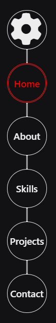
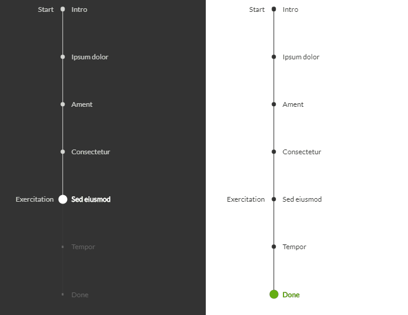

# Dein eigenes Projekt

Diese Aufgabe ist ein eigenes Projekt aufzubauen für dein Protfolio.

Baue bestimmte Elemente in dein Projekt ein.

## Allgemein

- Ein Logo im Header
- Navigationsleiste
  - home, about, services, contact, Login, Register
    - services als dropdown

## Landingpage

  

    Die Fast-Navigation ist eine Art Inhaltsangabe oder nur ein Deko-Element um zu sehen wo auf der Seite man sich befindet.

    - Aside Deko-Element (Timeline, Fast-Navi, oder etwas ähnliches)

    - Koppel die einzelnene Elemente an eine id und nutze den Bookmark-Jump

    - baue einen hover Effekt und einen onclick Effekt ein

  
  

# Content

Den Content deiner Seite bestimmst du selbst. Tobe dich voll aus nutze so viele techniken wie möglich und baue dein erstes Projekt. eine Seite, die dir persönlich am Herzen liegt.
